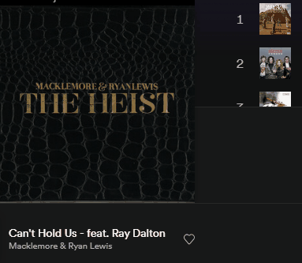

 
 
 
 

    
     
    <b><i>NO DELAY NO ADS</i></b>

# **Spotify Internal**

**Note:** This DLL is for the **[Desktop release](https://www.spotify.com/download/windows/)** of Spotify on Windows and not the Microsoft Store version. If you have the microsoft version, delete it and reinstall it from the link above.

## **Features:**
* Windows only
* Blocks all banner/video/audio ads within the app
* Unlocks the skip function for any track

## **Download and Usage:**
* Download the code **[here](https://github.com/R3nzTheCodeGOD/Spotify-Internal/releases)**
* If the dll and `installer.bat` are in the same directory, run installer.bat and if you get the successful message everything is ok

## How can i disable it ?
* You can disable it with `uinstaller.bat`, if there is a problem, delete `chrome_elf.dll` in `%appdata%/Spotify/` folder and remove the leading underscore from `_chrome_elf.dll`